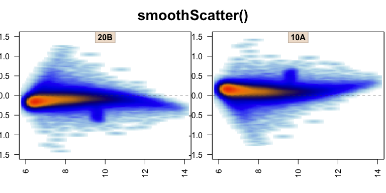
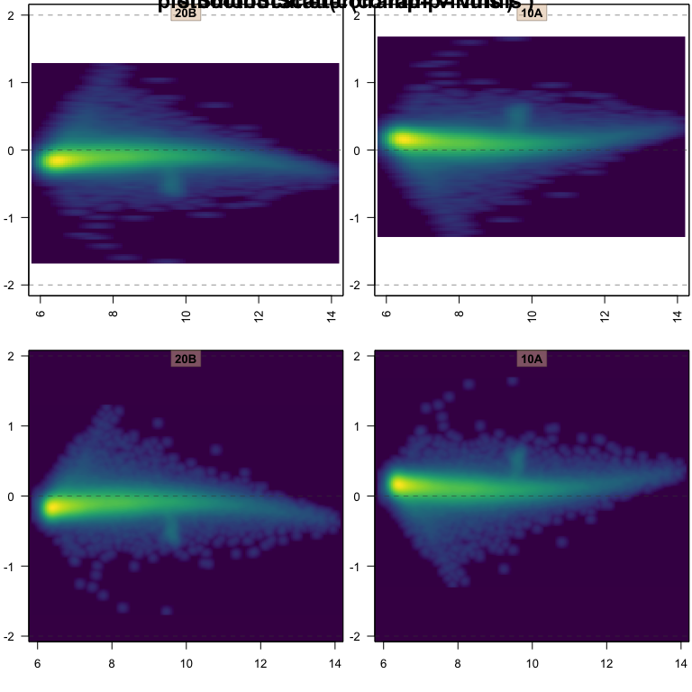

---
output:
  md_document:
    variant: markdown_github
---

<!-- README.md is generated from README.Rmd. Please edit that file -->


# jamma

The goal of jamma is to create MA-plots with several useful and powerful
capabilities that are intended to provide a more thorough understanding
of the data.

The main function provided is jammaplot(). It is distinct from similar
MA-plot functions in that it uses smooth scatter by default, and in
fact inspired the creation of a custom smooth scatter function provided
by the jamba package, plotSmoothScatter().


### Example MA-plot

A reasonable example MA-plot can be created using data from the affydata
package, if installed.


```r
if (suppressPackageStartupMessages(require(affydata))) {
   data(Dilution);
   edata <- log2(1+exprs(Dilution));
   jammaplot(edata);
}
```


### What is a smooth scatter plot, and why is it important for MA-plots?

MA-plots are typically created for gene expression data, historically
used for microarray data, which contains tens of thousands of rows.
Most MA-plot tools combat the number of points either by displaying
single pixel points (pch="." in R base plotting), or adding transparency.

A secondary issue is that these plots take a while to render when drawing
individual points. This effect is amplified when running on a remote server,
since each individual point is transmitted over the network for rendering.
Also when saving a figure, certain file types save each
point as an object, making the file size surprisingly large. If the file
is printed to paper (ha!) the printer can take a long time to prepare the
image for printing. And the volume of data is not currently getting smaller
with new technologies.

First, we show the same MA-plot using single pixel points:


```r
jammaplot(edata[,2:3], ylim=c(-1.5,1.5), titleCexFactor=0.8,
   smoothScatterFunc=function(col="navy",...){plot(pch=".",col="#000077",...)},
   maintitle="plot(pch='.')");
```


The overall range of points is clearly shown, but the density of points is
not clear from that plot. Adding alpha transparency helps somewhat:


```r
jammaplot(edata[,2:3], ylim=c(-1.5,1.5), titleCexFactor=0.8,
   smoothScatterFunc=function(col="navy",...){plot(pch=".",col="#00007711",...)},
   maintitle="plot(pch='.', alpha=0.07)");
```


The transparency helps visualize the massive number of points in the middle,
but now has made all the fun outlier points almost invisible. The typical
next step in R is to use smoothScatter(), shown below using its default
color ramp:


```r
jammaplot(edata[,2:3], ylim=c(-1.5,1.5), titleCexFactor=0.8,
   smoothScatterFunc=smoothScatter, colramp="Blues",
   maintitle="smoothScatter()");
```


Again, the visualization is improved, but the default "Blues" color ramp
(credit Brewer colors from RColorBrewer) could perhaps be improved.


```r
jammaplot(edata[,2:3], ylim=c(-1.5,1.5), titleCexFactor=0.8,
   smoothScatterFunc=smoothScatter,
   maintitle="smoothScatter()");
```



Now the figure depicts the full range of data, while also conveying the
truly massive number of points in the central region. Only two smaller issues
remain.

First, not visible here, the underyling data is plotted using tiny
rectangles. For the reasons described above, a large number of rectangles
can be problematic when saving as a vector image (PDF, SVG), when printing
on paper, or when rendering the figure across a remote network connection.
The solution is to use a rasterized image, instead of individual rectangles,
which can be compressed and resized.

Second, the pixel size used for the point density is flattened horizontally,
because the default density function uses the range of data, and not the
plot visible range. When the density function is applied to plot coordinates,
there is often some distortion. Visually small effect, but when there are
20 panels onscreen, the inconsistency becomes much more obvious.

The plotSmoothScatter function resolves both the issues described, with some
enhancements. It uses a density function based upon plot space, but also adds
detail, so smaller features are less blurry.


```r
jammaplot(edata[,2:3], ylim=c(-1.5,1.5), titleCexFactor=0.8,
   maintitle="plotSmoothScatter()");
```


It looks like a small effect here, but the density around single points is
now circular. When rendering a density map of plotted data points, it should
represent the true density of points as accurately as possible.

To demonstrate some other color effects, the plotSmoothScatter function also
fills the complete plot panel with the correct background color, which is not
done by smoothScatter().


```r
par("mfrow"=c(2,2));
jammaplot(edata[,2:3], ylim=c(-2,2), titleCexFactor=0.8,
   colramp="viridis", doPar=FALSE,
   smoothScatterFunc=smoothScatter,
   maintitle="smoothScatter(colramp='viridis')");
jammaplot(edata[,2:3], ylim=c(-2,2), titleCexFactor=0.8,
   colramp="viridis", doPar=FALSE,
   maintitle="plotSmoothScatter(colramp='viridis')");
```



